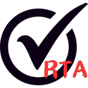
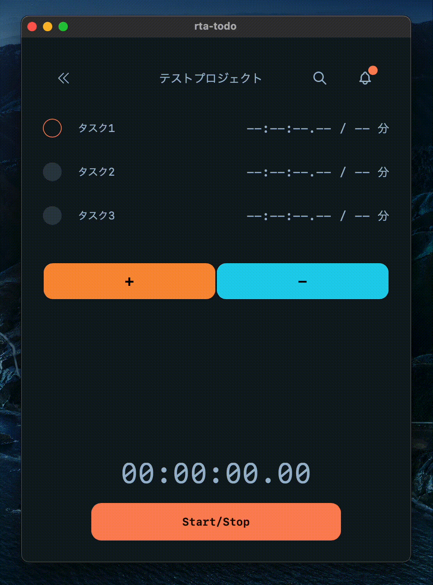

<h1 align="center">RTA-Todo</h1>

  

  <strong>
  This is an application for completing Todos in RTA (Real-Time Attack) format.
  </strong>

  
  

---

<h2 align="center">🌈 Demo</h2>

  

---

## 🎯 Features

<ul style="font-size: 1.2em;">
  <li><strong>Real-Time Attack (RTA) format</strong> - This application is for completing Todos in RTA format.</li>
  <li><strong>Simple and easy to use</strong> - You can easily add, delete, and complete Todos.</li>
  <li><strong>Dark mode</strong> - You can switch between light and dark mode.</li>
  <li><strong>Responsive design</strong> - This application is responsive and can be used on any device.</li>
</ul>

---

## 🚀 Getting Started

You can download this app from the [releases page]("https://github.com/gohan5858/rta-todo/releases")
This application has an auto-updater, so you don't need to install the new version by yourself.

### Supported platforms

- Windows
- MacOS
- Linux
